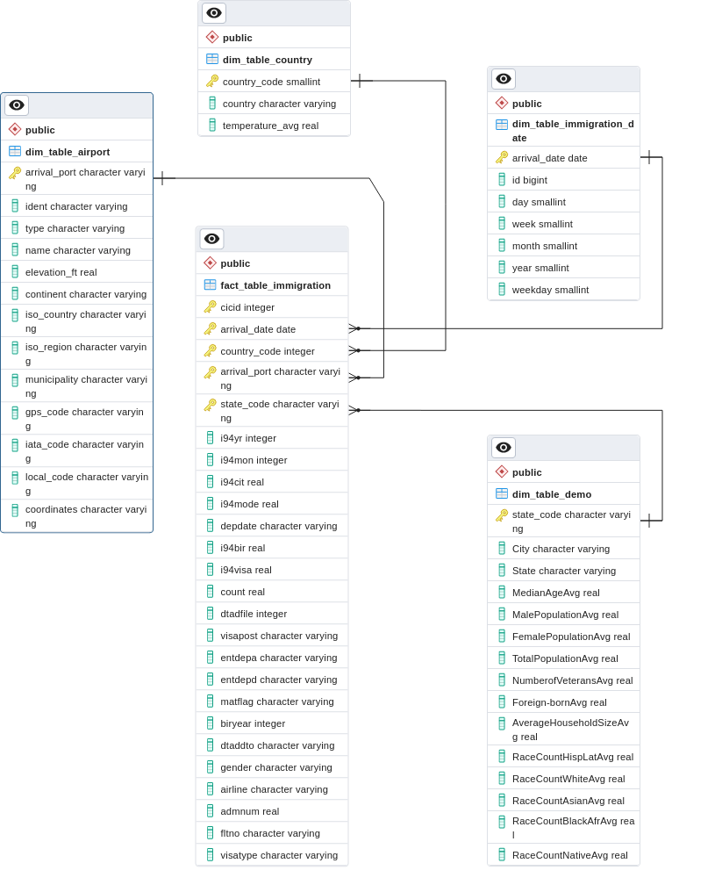

# ETL-Pipeline for US Immigration Data
## Data Engineering Capstone Project

### Project Summary
The goal of this project is to create an ETL pipeline that ultimately creates a star schema with a fact table describing immigration data for the US. Dimensional tables refer to time (immigration date) and multiple location (arrival state, arrival airport, country of origin) dimensions, and are enriched with additional data of interest.

Based on the data aggregated in the star schema, one can submit analytical queries to gain insight about e.g.

* temporal distribution of immigration events
* demographic details of the arrival state and connections to immigration characteristics
* connections between temperatures within origin countries and immigration details
* which airports and airlines are used by immigrants

The project exemplifies the following steps:
* Step 1: Scope the Project and Gather Data
* Step 2: Explore and Assess the Data
* Step 3: Define the Data Model
* Step 4: Run ETL to Model the Data
* Step 5: Complete Project Write Up

---
### Notebook

In the jupyter notebook `ETL Immigration.ipynb`, one can follow the basic steps used to create this project. 

Within the notebook, all conceptual work, data exploration, cleaning, and script execution are explained. It also includes the required write-ups for the project.

---

### ETL Script
**NOTE**: within the notebook, the project is only sketched, while a highly structured implementation of the ETL process can be found in the `etl` folder, containing the following files:

| File       | Description |
| -----------| ------------|
| etl.py     | main module that can be executed from shell to run the pipeline |
| config.py  | configuration of the etl process via pydantic |
| etl_extract.py | data extraction functions and classes used within main module |
| etl_load.py | data load functions and classes used within main module |
| requirements.txt | package requirements to execute script |
| config.json | default configuration in JSON format |

The script can be started from shell via `python etl.py` from the `etl` folder. For your own config (especially for input/output locations), adjust the config file. The config file `config.py` can be used as configuration-as-code, but you can also use the json-file (see command-line arguments on how to load). Different command-line arguments can be used: to get an overview, execute `python etl.py -h`. Usually, one wants to write the tables as parquet file/s - call the script via `python etl.py -wp`.

---

### Data Model

The conceptual data model is depicted in the ERD figure below. The central immigration fact table `fact_table_immigration` is connected to 4 dimension tables:

- `dim_table_airport`: the table contains information about airports and is referenced from the fact table via the primary key `arrival_port`
- `dim_table_country`: the table contains information about immigrants' origin country (temperature) and is referenced from the fact table via the primary key `country_code`
- `dim_table_immigration_date`: the table contains information about immigrants' arrival date and is referenced from the fact table via the primary key `arrival_date`
- `dim_table_demo`: the table contains information about demographics of about the immigrants' residence state in aggregated form and is referenced from the fact table via the primary key `state_code`

---
### Data Dictionary

- Immigration fact table (FactTableImmigration )

| Column               | Type     | Comment      |
| -------------------- | -------- | ------------ |
| cicid                | float   |      record ID        |
| i94yr                | float   |      year        |
| i94mon               | float    |         month     |
| i94cit               | float   |      birth country ID        |
| country_code         | integer   |      immigrant residence country ID (3 char code)       |
| arrival_port              | string   |    immigrant arrival port in US        |
| arrival_date              | string   |      arrival date in US      |
| i94mode              | float   |      transportation mode (air: 1, sea: 2, land: 3, else: 9)        |
| state_code              | string   |     arrival state         |
| depdate              | float   |      departure date        |
| i94bir               | float  | age       |
| i94visa              | float   |   visa code           |
| count                | float   |   auxiliary field           |
| dtadfile             | string    |  auxiliary date field            |
| visapost             | string   |   state of visa grant           |
| occup                | string   |   occupation in US           |
| entdepa              | string   |   arrival code           |
| entdepd              | string   |   departure code           |
| entdepu              | string   |   update code           |
| matflag              | string   |   matching code            |
| biryear              | float   |    birth year          |
| dtaddto              | string  | residence allowance date        |
| gender               | string   |  gender            |
| insnum               | string    |  INS number            |
| airline              | string   |  airline for arrival            |
| admnum               | float   |   admission number           |
| fltno                | string   |  flight number            |
| visatype             | string   |  type of visa            |

- Immigration dimension table (DimTableImmigrationDate)

| Column               | Type     | Comment      |
| -------------------- | -------- | ------------ |
| arrival_date      | string   |      immigrant arrival date in US       |
| id                | long   |      unique date ID        |
| day                | integer   |      arrival day        |
| week                | integer   |      arrival week        |
| month                | integer   |      arrival month        |
| year                | integer   |      arrival year        |
| weekday                | integer   |      arrival day of week        |

- Country dimension table (DimTableCountry)

| Column               | Type     | Comment      |
| -------------------- | -------- | ------------ |
| country_code         | integer  | 3 character country code   |
| country              | string   | name of country       |
| temperature_avg      | double   | average temperature within country      |

- Airport dimension table (DimTableAirport)

| Column               | Type     | Comment      |
| -------------------- | -------- | ------------ |
| arrival_port         | string   | name of airport |
| ident                | string   | airport identifier code            |
| type                 | string   | airport type            |
| elevation_ft         | float    | elevation in feet            |
| continent            | string   | airport continent             |
| iso_country          | string   | country ISO code             |
| iso_region           | string   | region ISO code             |
| municipality         | string   | name of municipality            |
| gps_code             | string   | GPS code            |
| iata_code            | string   | IATA code             |
| local_code           | string   | local airport code            |
| coordinates          | string   | tuple of latitude, longitude       |

- Demographic dimension table (DimTableDemo)

| Column               | Type     | Comment      |
| -------------------- | -------- | ------------ |
| state_code           | string   | code of the state |
| State                 | string   |    state name          |
| MedianAgeAvg           | float    |     average median resident age         |
| MalePopulationAvg      | float   |     average total number of male residents         |
| FemalePopulationAvg      | float   |   average total number of female residents           |
| TotalPopulationAvg        | int   |     average total population number         |
| NumberofVeteransAvg       | float   |  average average number of veterans           |
| Foreign-bornAvg             | float   |  average number of foreign born residents            |
| AverageHouseholdSizeAvg    | float   |   average number of people in households           |
| RaceCountHispLatAvg                | float   |   average hispanic race count     |
| RaceCountWhiteAvg                | float   |   average white race count     |
| RaceCountAsianAvg                | float   |   average asian race count      |
| RaceCountBlackAfrAvg                | float   |   average black/african race count     |
| RaceCountNativeAvg                | float   |   average native race count      |

---